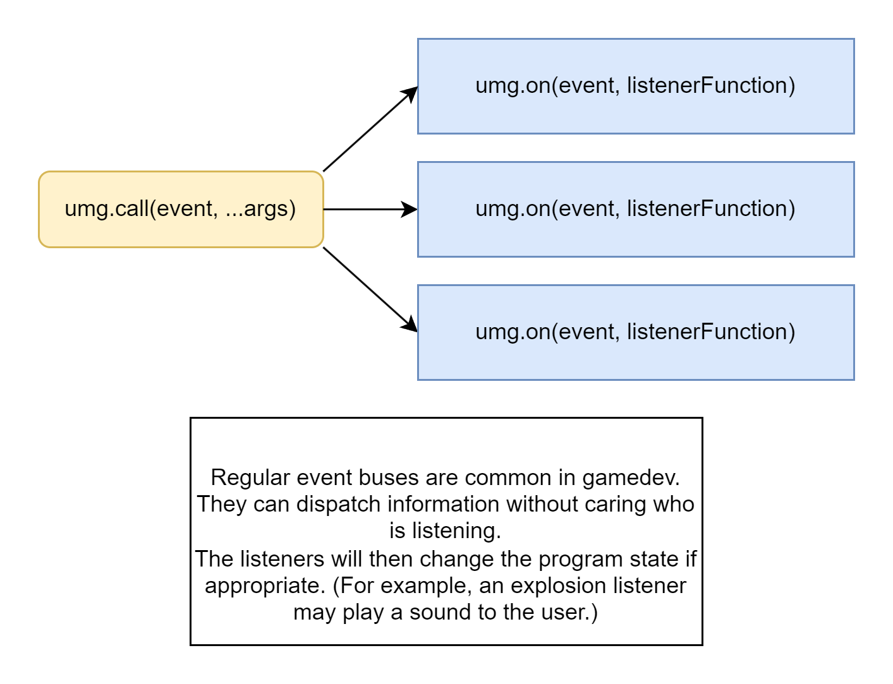
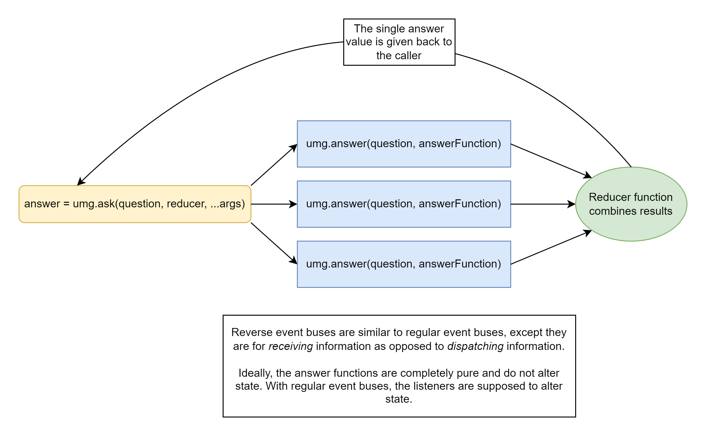

# rs-buses

Implements basic [event-buses and question-buses](https://github.com/pakeke-constructor/ideas/blob/master/question_buses.md) in Rust.

I'm not sure how useful these will be, (given how much Rust hates state,) but I still thought it was fun to make.

## Diagrams:

